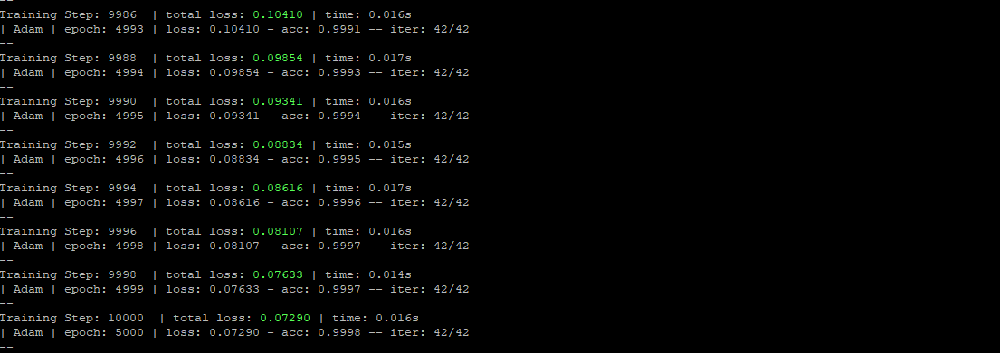

# Acute Myeloid Leukemia Detection System Chatbot/NLU Engine
 

# Introduction
The **Acute Myeloid Leukemia Detection System Chatbot/NLU Engine** hosts a local API server that allows applications to manage training data, train the chatbot, and carry out inference. API endpoints provide access to an **NLU** classifier and the dataset. A small dataset is provided for you to build on and is based on knowledge about Acute Myeloid Leukemia. This project is used in conjunction with the 

# What Will We Do?
This tutorial will help you setup the NLU Engine required for your Acute Myeloid Leukemia Detection System. In detail this guide will cover the following:

- Installing and setting up required software
- Creating your intent and entity training data
- Training your intent and entity classifiers
- Testing your classifier locally in real time
- Testing your classifier API via a client

# Example Output
The following is an unedited basic conversation within the capabilities provided by the example training data:

```
upsquared@upsquared-UP-APL01:~/AML-Detection-System/Chatbot$ python3 Run.py INPUT
2018-12-22 07:44:08|Data|INFO: Training Data Ready
2018-12-22 07:44:08|Data|INFO: Model Data Ready

>Hello
2018-12-22 07:44:12|Human|Intent: Hello
2018-12-22 07:44:12|GeniSys|Reponse: ('Hello', [])

>What is Acute Myeloid Leukemia?
2018-12-22 07:44:22|Human|Intent: What is Acute Myeloid Leukemia?
2018-12-22 07:44:22|GeniSys|Reponse: Acute Myeloid Leukemia, or AML, is a rare and agressive form of Leukemia. With AML, mutated white blood cells attack and kill healthy red cells.

>I was wondering if AML affects people that older more than younger people, or the other way round?
2018-12-22 07:45:12|Human|Intent: I was wondering if AML affects people that older more than younger people, or the other way round?
2018-12-22 07:45:12|GeniSys|Reponse: According to cancer.org, AML is generally a disease of older people and is uncommon before the age of 45. The average age of people when they are first diagnosed with AML is about 68. But AML can occur in children as well.

>OK, I am interested about the Acute Myeloid Leukemia Detection System
2018-12-22 07:45:46|Human|Intent: OK, I am interested about the Acute Myeloid Leukemia Detection System
2018-12-22 07:45:46|GeniSys|Reponse: The AML (Acute Myeloid Leukemia) Detection System is an open source Acute Myeloid Leukemia Detection System including data management, training and running facial and image classifiers on the edge with Intel technologies. The project includes an Android chatbot app, a natural language understanding engine, a convolutional neural network classifier, a siamese neural network classifier and  a locally hosted web based UI.

>Ah, what is the AML Research Project?
2018-12-22 07:47:53|Human|Intent: Ah, what is the AML Research Project?
2018-12-22 07:47:53|GeniSys|Reponse: The Acute Myeloid Leukemia AI Research Project is an open source project researching and developing Artificial Intelligence for early detection of AML and for drug discovery.

>Thanks
2018-12-22 07:47:58|Human|Intent: Thanks
2018-12-22 07:47:58|GeniSys|Reponse: No problem! Glad I could help!
```

# Operating System
- Tested on [Ubuntu 16.04.5 LTS (Xenial Xerus))](http://releases.ubuntu.com/16.04/ "Ubuntu 16.04.5 LTS (Xenial Xerus)") and [Ubuntu 18.04.1 LTS (Bionic Beaver)](http://releases.ubuntu.com/18.04/ "Ubuntu 18.04.1 LTS (Bionic Beaver)"), previous versions have been tested in Windows successfully but you need to make sure you install MITIE correctly on your Windows machine.

# Python Versions
- Tested with Python 3.5

# Software Requirements
- [Tensorflow 1.4.0](https://www.tensorflow.org/install "Tensorflow 1.4.0") (May work with other versions)
- [TFLearn](http://tflearn.org/ "TFLearn")
- [MITIE](https://github.com/mit-nlp/MITIE "MITIE")
- [NTLK (Natural Language Toolkit)](https://www.nltk.org/ "NTLK (Natural Language Toolkit)")

# Hardware Requirements
- 1 x Desktop device or laptop for development and training, prefereably with an NVIDIA GPU

# Installation & Setup
The following guides will give you the basics of setting up a GeniSys NLU Engine. 

## Clone The Acute Myeloid Leukemia Detection System Repo

First you need to clone the Acute Myeloid Leukemia Detection System repo to the machine you will be running it on. To do so, navigate to the directory you want to place it in terminal and execute the following command:

```
 $ git clone https://github.com/AMLResearchProject/AML-Detection-System.git
```

Once you have done this, you have all the code you need on your machine. 

## Install The Required Software
Now you need to install the required software, I have provided a requirements file that will contain all required modules for the project. You can use it to install the modules using the following command: 

```
 $ sh setup.sh 
```

The command execute the setup shell file which will istall the required software for the project including **NTLK**, **TFLearn**, **MITIE**. If for any reason the pip3 installs fail, you will have to install them manually:

```
 $ pip3 install ..... --user
 ```

# Training Data
Now it is time to think about training data. In the [Model/Data/training.json](https://github.com/AMLResearchProject/AML-Detection-System/tree/master/Chatbot/Model/Data/training.json "Model/Data/training.json") file I have provided some starter data, it is not a lot but enough to have a good test and show the example further on in the tutorial. 

## Extensions
Extensions are external Python classes that you can use to extend the functionality used to generate a response. Extensions should be stored in the [extensions](https://github.com/AMLResearchProject/AML-Detection-System/tree/master/Chatbot/extensions "extensions") directory.

# Training Your NLU Engine
[](https://github.com/AMLResearchProject/AML-Detection-System/blob/master/Chatbot/Train.py)

Now everything is set up, it is time to train. The main functionality for the training process can be found in [Train.py](https://github.com/AMLResearchProject/AML-Detection-System/blob/master/Train.py "Train.py"), [Classes/Data.py](https://github.com/AMLResearchProject/AML-Detection-System/blob/master/Classes/Data.py "Classes/Data.py"), [Classes/Model.py](https://github.com/AMLResearchProject/AML-Detection-System/blob/master/Classes/Model.py "Classes/Model.py") and  [Classes/Mitie.py](https://github.com/AMLResearchProject/AML-Detection-System/blob/master/Classes/Mitie.py "Classes/Mitie.py"), the configuration for training can be found and modified in [Required/confs.json](https://github.com/AMLResearchProject/AML-Detection-System/blob/master/Required/confs.json "Required/confs.json"). If you have modified your training data, you may need to update your configuration from time to time. 

To begin training, make sure you are all set up, navigate to the root of the project and execute the following command:

```
 $ python3 Run.py TRAIN
```

# Communicating with your AI Locally
Now you have trained your AI, it is time to test her out! In this tutorial I will base my explanation on the conversation block at the beginning of this tutorial.  As your AI is now trained, all you need to do (assuming you are in the project root), is execute the following code:

```
 $ python3 run.py INPUT
```

If you have looked through the example dataset, you may notice that **I was wondering if AML affects people that older more than younger people, or the other way round?** is not in the training data, the actual training data provided to the AI related to this question is actually:

```
"intent": "AMLAge",
"text": [
    "Who does AML affect?",
    "Who does Acute Myeloid Leukemia affect?",
    "What age group does AML affect?",
    "What age group does Acute Myeloid Leukemia affect?",
    "How old do you have to be to get AML?",
    "How old do you have to be to get Acute Myeloid Leukemia?",
    "Does Acute Myeloid Leukemia affect older or younger people?"
]
```

You can see that although **I was wondering if AML affects people that older more than younger people, or the other way round?** is not in the training data, the AI was still able to classify and respond correctly. 

# Inference Via The HTTP Requests
You can run the Run program in server mode to fire up an API endpoint that allows you to do inference via HTTP calls. To start your NLU engine in server mode, you can enter the following commands into terminal:

```
 $ python3 run.py SERVER
```

You will now be able to access your NLU by posting to http://YourDomain:YourPort/infer, to do this, I provided an an API client programmed in Python which takes your input from console and sends it to the server for processing: [Acute Myeloid Leukemia Detection System Chatbot Client](https://github.com/AMLResearchProject/AML-Detection-System/blob/master/Chatbot/Client.py "Acute Myeloid Leukemia Detection System Chatbot Client").

Navigate to the project root and execute the following command to send a query to your NLU engine, you can use any question or statement, but bear in mind it must be within the boundaries of variations of the training date.

```
 $ python3 Client.py CLASSIFY "Can you tell me what age groups Acute Myeloid Leukemia would mainly affect?"
```

# Useful Links

Links to related articles that helped at various stages of the project for research / code examples:

- [TFLearn Quickstart](http://tflearn.org/tutorials/quickstart.html "TFLearn Quickstart")
- [Bag of Words Algorithm in Python Introduction](http://insightsbot.com/blog/R8fu5/bag-of-words-algorithm-in-python-introduction "Bag of Words Algorithm in Python Introduction")
- [Chatbot Architecture](https://medium.com/@surmenok/chatbot-architecture-496f5bf820ed "Chatbot Architecture")
- [Contextual Chatbots with Tensorflow](https://chatbotsmagazine.com/contextual-chat-bots-with-tensorflow-4391749d0077 "Contextual Chatbots with Tensorflow")
- [RasaNLU](https://github.com/RasaHQ/rasa_nlu/ "RasaNLU")

# Stay Tuned!!
The dataset will continue to grow so if you use this project, make sure you return regularly to get the latest dataset and any code updates for your project.

# Contributing
Please read [CONTRIBUTING.md](https://github.com/AMLResearchProject/AML-Detection-System/blob/master/CONTRIBUTING.md "CONTRIBUTING.md") for details on our code of conduct, and the process for submitting pull requests to us.

# Versioning
We use SemVer for versioning. For the versions available, see [Releases](https://github.com/AMLResearchProject/AML-Detection-System/releases "Releases").

# License
This project is licensed under the **MIT License** - see the [LICENSE](https://github.com/AMLResearchProject/AML-Detection-System/blob/master/LICENSE "LICENSE") file for details.

# Bugs/Issues
We use the [Issues](https://github.com/AMLResearchProject/AML-Detection-System/issues "Issues") to track bugs and general requests related to using this project. 

# Author
Adam is a [BigFinite](https://www.bigfinite.com "BigFinite") IoT Network Engineer, part of the team that works on the core IoT software. In his spare time he is an [Intel Software Innovator](https://software.intel.com/en-us/intel-software-innovators/overview "Intel Software Innovator") in the fields of Internet of Things, Artificial Intelligence and Virtual Reality.

[](https://github.com/AdamMiltonBarker)