# Peter Moss Acute Myeloid & Lymphoblastic Leukemia AI Research Project
## Acute Lymphoblastic Leukemia Detection System 2019
### Embedded World 2019 Nuremberg Germany

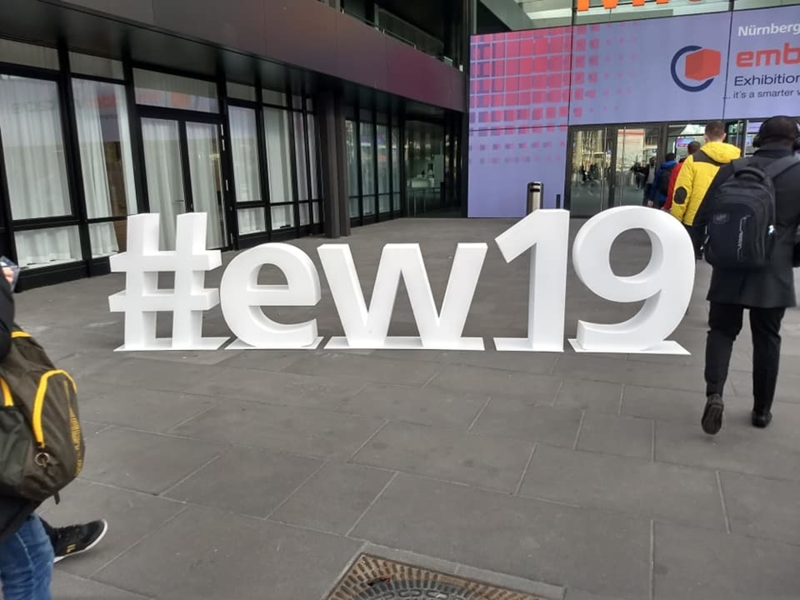

In February 2019, team members [Adam Milton-Barker](https://www.leukemiaresearchassociation.ai/team/adam-milton-barker "Adam Milton-Barker") and [Estela Cabezas](https://www.leukemiaresearchassociation.ai/team/estela-cabezas "Estela Cabezas") demonstrated the Peter Moss Acute Lymphoblastic Leukemia Detections System 2019 at Embedded World with Intel.

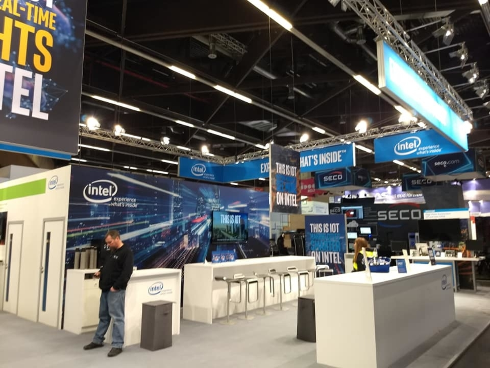

Adam has been an Intel Software Innovator since January 2017, through the program, which supports independent developers, Adam receives hardware, speakerships & event opportunities, as well as technical advice and support through the various on and offline communities.

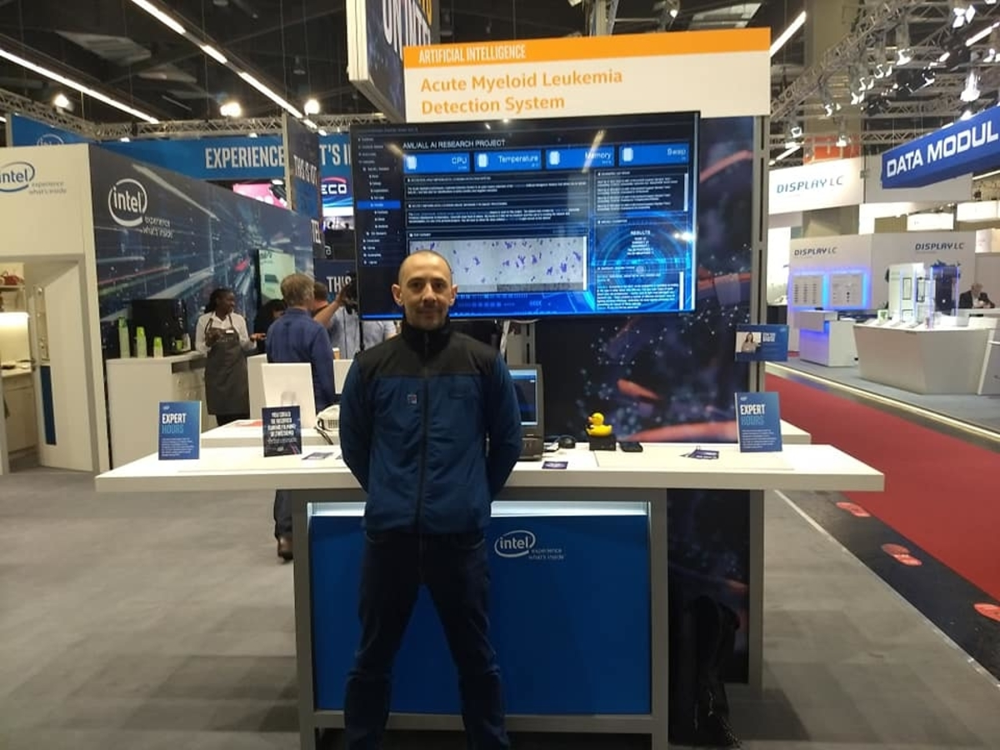

Estela was currently taking her degree in Biotechnology @ Universitat de Vic, Catalunya, Spain. Estela volunteered her time to help demo the project at Embedded World in Germany and did an amazing job on and off the stand throughout the whole week. Her knowledge / expertise in medical research was a valuable asset to the demonstration and the project as a whole. Through her involvement in the project, Estela is now also part of the Intel Software Innovator Program and has since represented the team/project at Intel Developer Affinity Day at Intel's IoT Lab in Munich Germany.

Intel Software Innovator Oyinlola Oluwatobi from Nigeria also assisted with booth duty during the event, speaking with visitors and talking bout thr project. Tobi (Oyinlola) was at Embedded World as a speaker and has a very inspiring story behind the work he is doing in Africa. Working with the German government, Tobi is piloting a Pay-As-You-Cook system that will allow Rwandan locals to pay only for the gas they use whilst cooking, making gas more available and reducing the requirement to use charcoal.

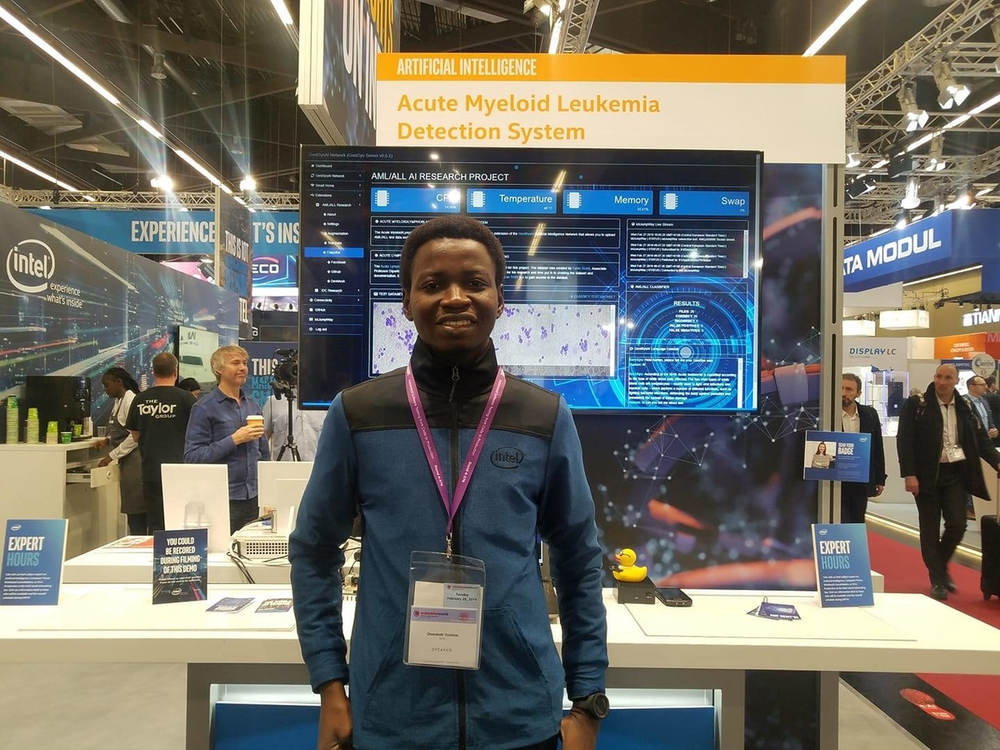

The event was an amazing success, the team was able to present the project and talk about the story behind the project to the public, Intel staff, AI/ML/DL researchers and students. The team had an amazing position at the Intel booth and had many people visit to find out what we are doing. 

Adam was interviewed by the media and gave them a demonstration of the project, and Intel featured our project in articles, videos and social media posts.

&nbsp;

- [VIDEO: Intel’s strategy for developing tools, kits, and systems](https://twitter.com/Inteliot/status/1100878351030513670 "VIDEO: Intel’s strategy for developing tools, kits, and systems")

- [VIDEO: Rod O'Shea Director IoT Partnerships](https://twitter.com/Inteliot/status/1101165269857325057 "VIDEO: Rod O'Shea Director IoT Partnerships")

- [ARTICLE: Harness the Power of Data from Connected Things](https://software.intel.com/en-us/blogs/2019/02/26/harness-the-power-of-data-from-connected-things "ARTICLE: Harness the Power of Data from Connected Things")

&nbsp;

[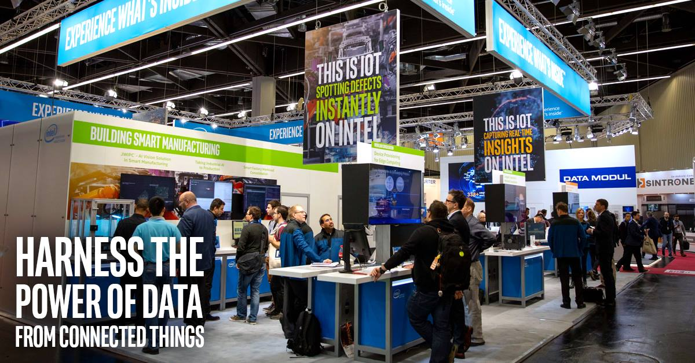](https://software.intel.com/en-us/blogs/2019/02/26/harness-the-power-of-data-from-connected-things)

&nbsp;

Big thank you to Intel for making this happen, and also to Estela & Tobi for their support and dedication to the project! Below are some photos from the event.

&nbsp;

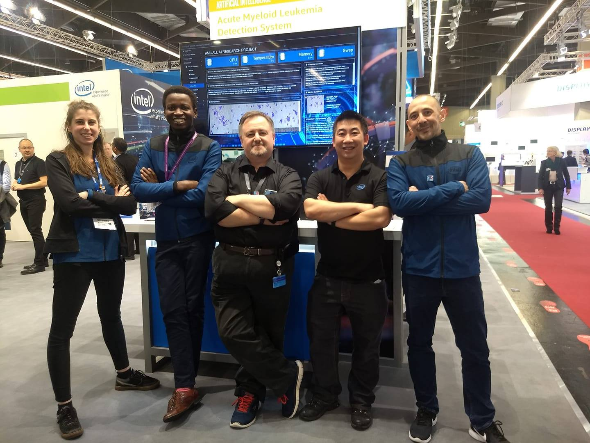

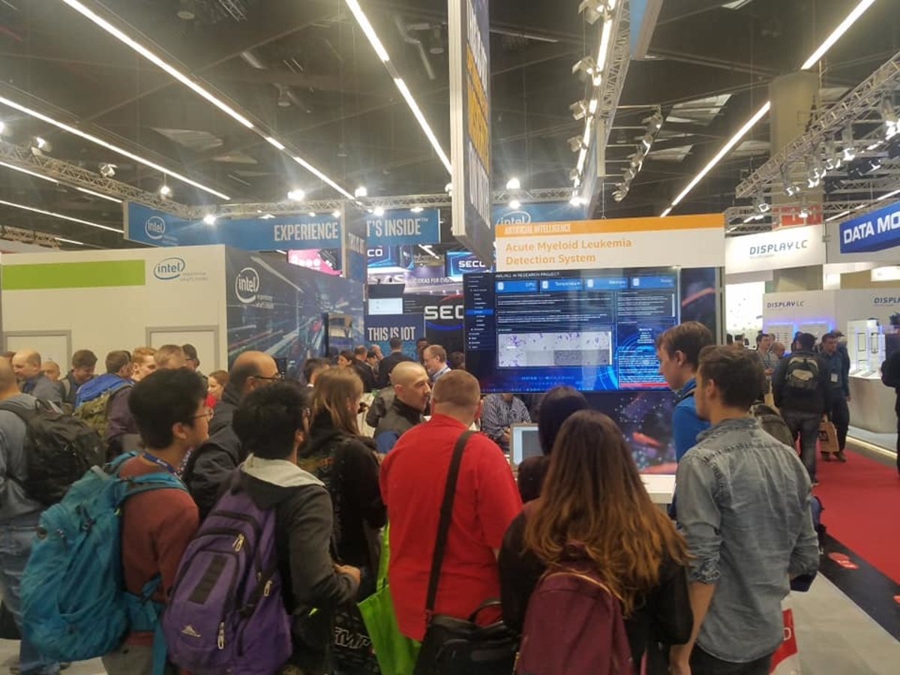

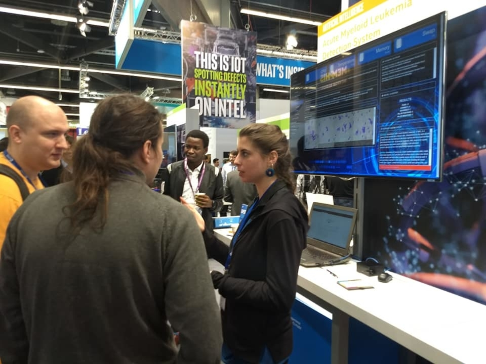

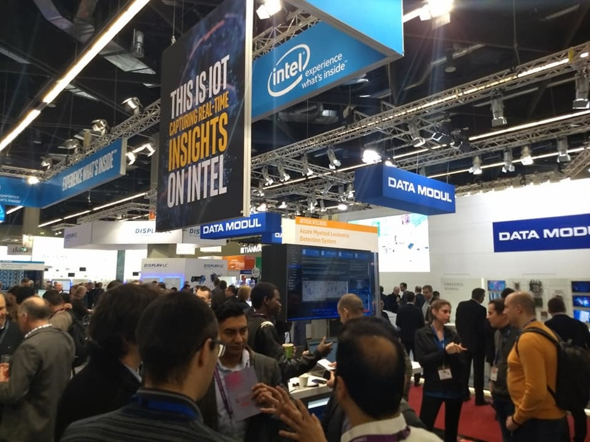

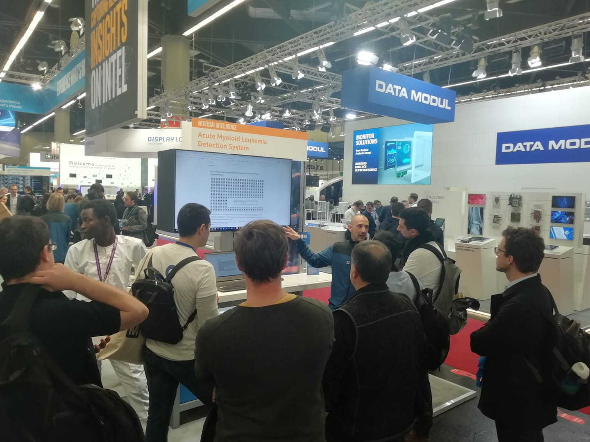

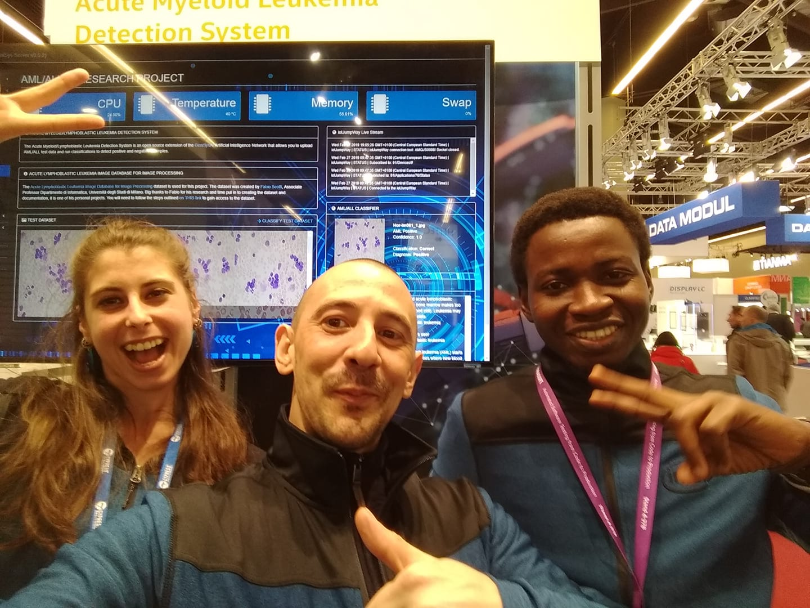

&nbsp;

You can find out more information about the event and view more photos on our official [Facebook Page](https://www.facebook.com/AMLResearchProject "Facebook Page").
