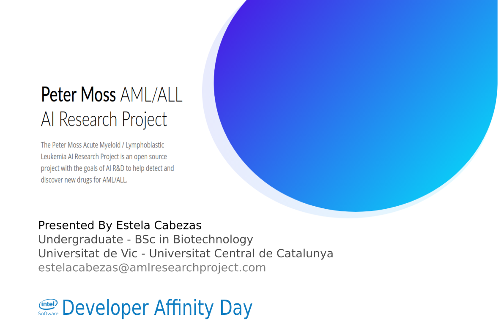
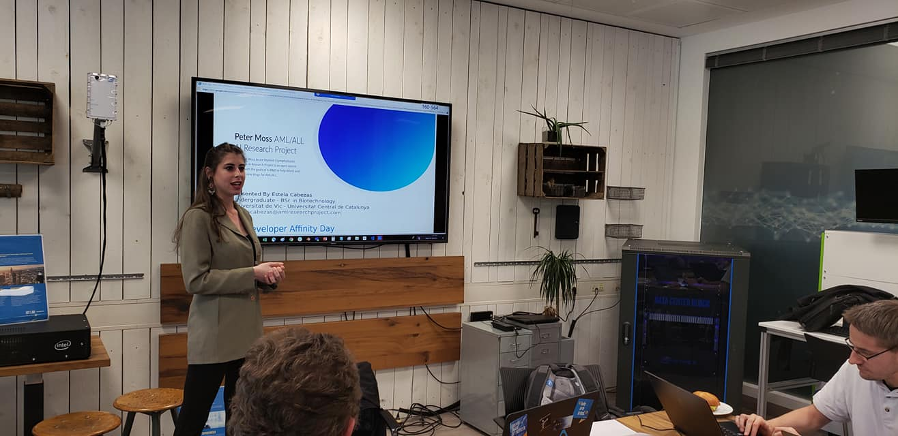
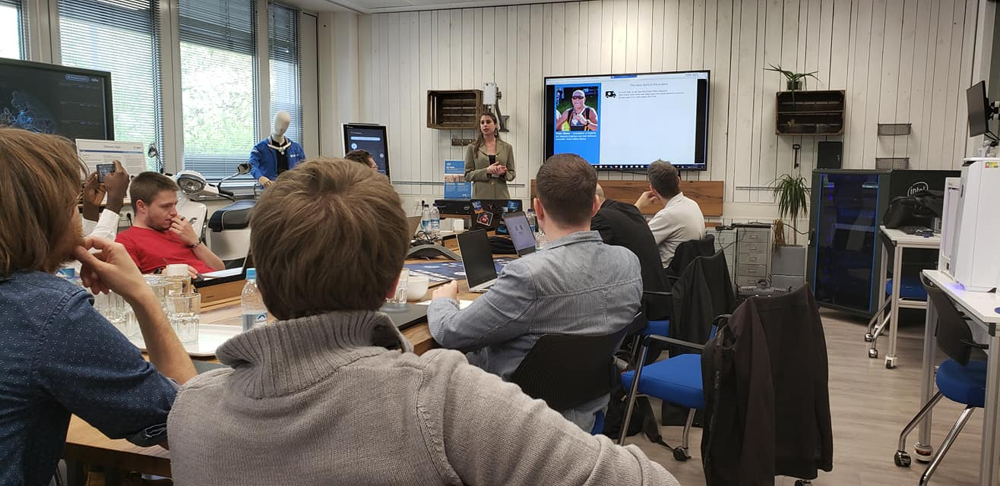
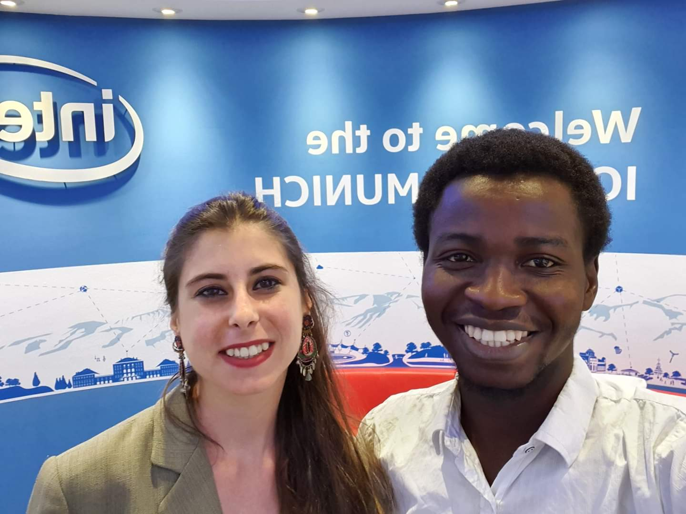
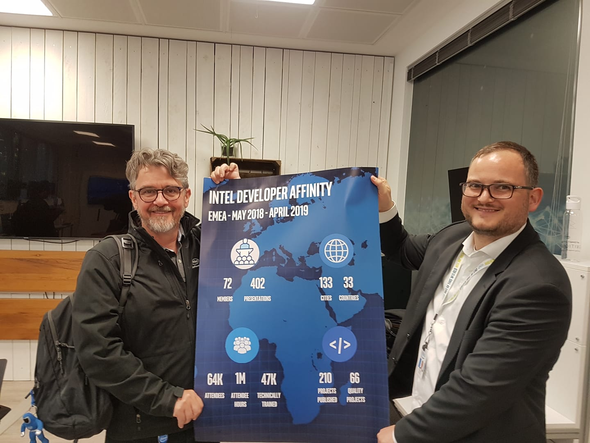
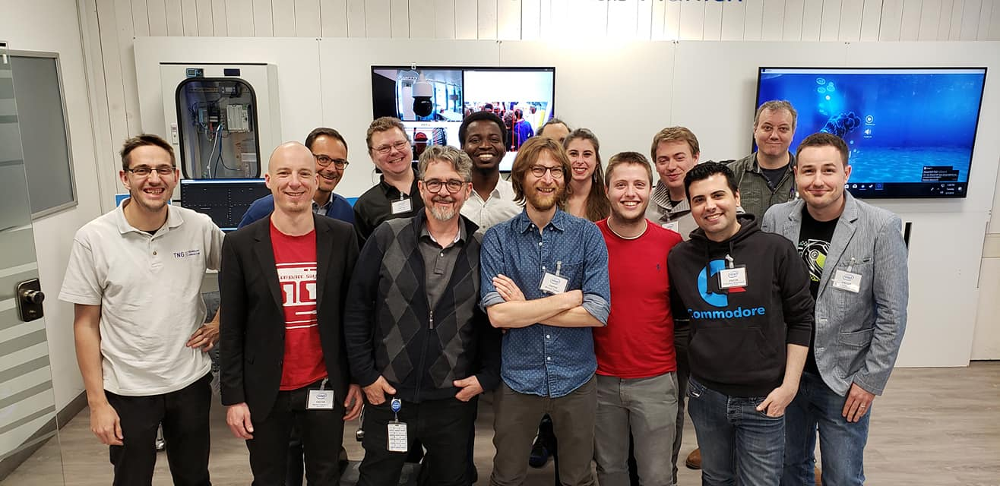
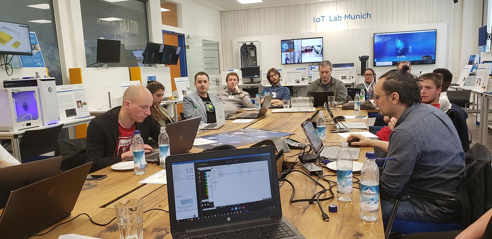

# Peter Moss Acute Myeloid & Lymphoblastic Leukemia AI Research Project
## Acute Lymphoblastic Leukemia Detection System 2019
### Intel Developer Affinity Day Munich Germany

The Peter Moss Acute Myeloid & Lymphoblastic Leukemia AI Research Project team was invited to attend an invite only event at Intel GmbH in Munich Germany. The purpose of the event was to pull EU Intel Software Innovators and Student Ambassadors together to showcase their projects to Intel staff and executives.

[Estela Cabezas](https://www.leukemiaresearchassociation.ai/team/estela-cabezas "Estela Cabezas") represented the team and presented our project along with other Innovators while getting a chance to provide feedback to key Intel executives heading Intel Software programs world wide.

Estela was able to talk about the story behind our project and give insight into the technical and medical research happening in our project.

- [Download the presentation](https://docs.google.com/presentation/d/1tlzBJjBq08lrZQeDpj6U84WlYC8EXOvkS39fXPQW8p0/edit?usp=sharing "Download the presentation")

Among the Intel Software Innovators invited to the event was Oyinlola Oluwatobi who helped demonstrate the AML / ALL Detection System at [Embedded World in Nuremberg Germany](https://github.com/AMLResearchProject/AML-ALL-Detection-System/tree/master/Events/Germany/1-Embedded-World-2019.md "Embedded World in Nuremberg Germany") in February.

Big thank you to Intel for making this happen and to Estela for volunteering her time and her continued support and dedication to the project! Below are some photos from the event.

You can find out more information about the event and view more photos on our official [Facebook Page](https://www.facebook.com/AMLResearchProject "Facebook Page").
