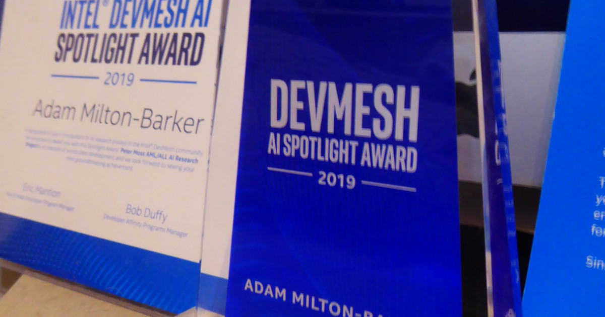
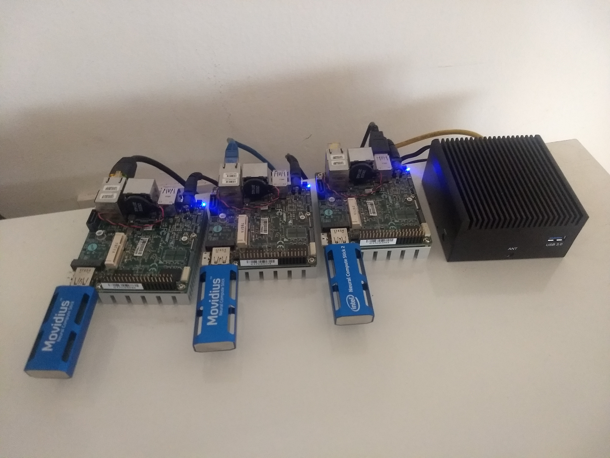

# Peter Moss Acute Myeloid & Lymphoblastic Leukemia AI Research Project
## Acute Lymphoblastic Leukemia Detection System 2019

   

&nbsp;

# Table Of Contents

- [Introduction](#introduction)
- [Intel® DevMesh AI Spotlight Award](#intel-devmesh-ai-spotlight-award)
- [Intel® Technologies](#Intel®-technologies)
- [Related Events](#related-events)
- [Related Team Publications](#related-team-publications)
- [Projects](#projects)
- [Contributing](#contributing)
    - [Contributors](#contributors)
- [Versioning](#versioning)
- [License](#license)
- [Bugs/Issues](#bugs-issues) 

&nbsp;

# Introduction
The Peter Moss Acute Myeloid & Lymphoblastic Leukemia Detection System is an opensource classifier with a locally hosted, database driven UI for data management, training, and running inference on Convolutional Neural Networks on the edge. This project was our official demo for 2019 and leverages Intel® technologies such as the UP2/UP2 AI Vision Dev Kit and Movidius NCS.

This project is made up of a number of components which work together to provide a locally hosted management system. Follow the completed tutorials below in the provided order. A full system setup requires [Server](Server "Server"), [Facial-Auth](Facial-Auth "Facial-Auth"), [Data Augmentation](Augmentation "Data Augmentation"), [NCS1 Tensorflow Classifier](NCS1/ "NCS1 Tensorflow Classifier"), and [Chatbot](Chatbot "Chatbot").

&nbsp;

# Intel® DevMesh AI Spotlight Award

In 2019 the Acute Lymphoblastic Leukemia Detection System 2019 was awarded the Intel® Devmesh AI Spotlight Award. Our project was one of 4 projects, and 1st from Europe, awarded the then new designation granted by Intel recognizing inspiring and breakthrough Artificial Intelligence projects in development from the Intel software community.

&nbsp;

# Intel® Technologies

_UP Squared & Movidius NCS1._

This project uses various Intel® technologies such as [UP2](https://up-shop.org/up-squared-series.html "UP2"), [Intel® Movidius Neural Compute Stick 1](https://software.Intel®.com/en-us/neural-compute-stick "Intel® Movidius Neural Compute Stick 1") and [Intel® AI DevCloud](https://software.Intel®.com/en-us/ai/devcloud "Intel® AI DevCloud") to enhance the training process and combine powerful CNNs with edge technologies for Internet of Things networks.

A number of our team members are [Intel® Software Innovators](https://software.Intel®.com/en-us/Intel®-software-innovators/overview "Intel® Software Innovators"), part of an Intel® program that supports independent developers with the latest Intel® hardware/software, speakerships & event opportunities, as well as technical advice and support through the various on and offline communities.

&nbsp;

# Related Events

| Event                                                                                                                                                                                                                                                                                                                                                                      | Description                                                                                                                         
| ---------------------------------------------------------------------------------------------------------------------------------------------------------------------------------------------------------------------------------------------------------------------------------------------------------------------------------------------------------------------------- | ----------------------------------------------------------------------------------------------------------------------------------- | 
| [Embedded World in Nuremberg Germany](Events/Germany/1-Embedded-World-2019.md "Embedded World in Nuremberg Germany")                                                                                                                                                                                                                                                                   | In February 2019, team members [Adam Milton-Barker](https://www.leukemiaresearchassociation.ai/team/adam-milton-barker "Adam Milton-Barker") and [Estela Cabezas](https://www.leukemiaresearchassociation.ai/team/estela-cabezas "Estela Cabezas") demonstrated the Peter Moss Acute Lymphoblastic Leukemia Detection System 2019 at Embedded World at the Intel®'s booths area.                                             |
| [Intel® Developer Affinity Day in Munich Germany](Events/Germany/2-Intel®-Developer-Affinity-Day-2019.md "Intel® Developer Affinity Day in Munich Germany")                                                                                                                                                                                                                                                                   | In May 2019 [Estela Cabezas](https://www.leukemiaresearchassociation.ai/team/estela-cabezas "Estela Cabezas") represented the team and presented our project an invite only event at Intel® GmbH in Munich Germany.

&nbsp;

# Related Team Publications

- [Applied Analytics for clinical decision support (Bachelor Thesis)](https://www.leukemiaresearchassociation.ai/research-projects/media/pdfs/estela-cabezas-bachelor-thesis.pdf "Applied Analytics for clinical decision support (Bachelor Thesis)") - [Estela Cabezas](https://www.leukemiaresearchassociation.ai/team/estela-cabezas "Estela Cabezas")

- [Acute Myeloid/Lymphoblastic Leukemia Data Augmentation (Intel® AI Developer Program)](https://software.Intel®.com/en-us/articles/acute-myeloidlymphoblastic-leukemia-data-augmentation "Acute Myeloid/Lymphoblastic Leukemia Data Augmentation (Intel® AI Developer Program)") - [Adam Milton-Barker](https://www.leukemiaresearchassociation.ai/team/adam-milton-barker "Adam Milton-Barker")

- [Inception V3 Deep Convolutional Architecture For Classifying Acute Myeloid/Lymphoblastic Leukemia (Intel® AI Developer Program)](https://software.Intel®.com/en-us/articles/inception-v3-deep-convolutional-architecture-for-classifying-acute-myeloidlymphoblastic "Inception V3 Deep Convolutional Architecture For Classifying Acute Myeloid/Lymphoblastic Leukemia (Intel® AI Developer Program)") - [Adam Milton-Barker](https://www.leukemiaresearchassociation.ai/team/adam-milton-barker "Adam Milton-Barker")

&nbsp;

# Projects

| Project                                                                                                                                                                                                                                                                                                                                                                      | Description                                                                                                                         | Status      |
| ---------------------------------------------------------------------------------------------------------------------------------------------------------------------------------------------------------------------------------------------------------------------------------------------------------------------------------------------------------------------------- | ----------------------------------------------------------------------------------------------------------------------------------- | ----------- |
| [Server](Server "Server")                                                                                                                                                                                                                                                                   | A local PHP/MySQL server hosting a web based UI for managing and classifying data. Based on the [GeniSysAI Server](https://github.com/GeniSysAI/Server "GeniSysAI Server").                                             | Complete |
| [Facial-Auth](Facial-Auth "Facial-Auth")                                                                                                                                                                                                                                                    | Siamese Neural Networks used for facial authentication. Hosts a REST API endpoint that exposes the model for remote classification.          | Complete    |
| [Augmentation](Augmentation "Data Augmentation")                                                                                                                                                                                                                                         | Applies filters to the original dataset and increases the amount of training data used for the [NCS1 Tensorflow Classifier](NCS1 "NCS1 Tensorflow Classifier").                                           | Complete    |
| [NCS1 Tensorflow Classifier](NCS1 "NCS1 Tensorflow Classifier") | The Acute Lyphoblastic Leukemia Detection System 2019 Tensorflow NCS1 Classifier, using NCS & NCSDK. Hosts a REST API endpoint that exposes the model for remote classification. | Complete    |
| [Chatbot](Chatbot "Chatbot")                                                                                                                                                                                                                                                             | A Tensorflow Natural Language Understanding Engine trained with basic knowledge of AML. Hosts a REST API endpoint that exposes the model for remote classification                     | Complete    |

&nbsp;

# Contributing

The Peter Moss Acute Myeloid & Lymphoblastic Leukemia AI Research project encourages and welcomes code contributions, bug fixes and enhancements from the Github.

Please read the [CONTRIBUTING](CONTRIBUTING.md "CONTRIBUTING") document for a full guide to forking our repositories and submitting your pull requests. You will also find information about our code of conduct on this page.

## Contributors

- [Adam Milton-Barker](https://www.leukemiaresearchassociation.ai/team/adam-milton-barker "Adam Milton-Barker") - [Asociacion De Investigation En Intel®igencia Artificial Para La Leucemia Peter Moss](https://www.leukemiaresearchassociation.ai "Asociacion De Investigation En Intel®igencia Artificial Para La Leucemia Peter Moss") President & Lead Developer, Sabadell, Spain

&nbsp;

# Versioning

We use SemVer for versioning. For the versions available, see [Releases](releases "Releases").

&nbsp;

# License

This project is licensed under the **MIT License** - see the [LICENSE](LICENSE "LICENSE") file for details.

&nbsp;

# Bugs/Issues

We use the [repo issues](issues "repo issues") to track bugs and general requests related to using this project.
