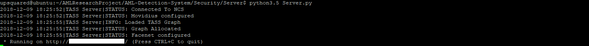
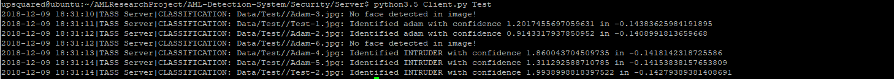

# Acute Myeloid Leukemia Detection System Security Server
 

# Introduction
The **Acute Myeloid Leukemia Detection System Security Server** hosts a local API server that allows applications to manage the known faces dataset and classify whether faces are known or unknown. API endpoints provide access to a **Facenet** classifier and the dataset. Facenet uses **Siamese Neural Networks** trained with **Triplet Loss**, Siamese Networks and Triplet Loss are used in this project due to their ability to help overcome the **Open Set Recognition Issue** in **facial recogniton**. 

The project runs on an **UP Squared** IoT development board and uses an **Intel® Movidius™ Neural Compute Stick** and shows how computer vision can be run on gateway devices on **the edge**, as well as lower spec IoT devices such as UP Squared or Raspberry Pi.

## Open Set Recognition Issue
 
Credit: [Walter J. Scheirer](https://www.wjscheirer.com/projects/openset-recognition/ "Walter J. Scheirer")

The Open Set Recognition Issue is a common, and unsolved issue with real world computer vision systems. The Open Set Recognition issue is especially common in facial recognition. Say you have a Convolutional Neural Network trained using Transfer Learning and Inception V3, you have trained the network to be able to detect Person 1 and Person 2 and your network is accurately classifying between Person 1 and Person 2. Now you introduce Person 3 to the network, more than likely your network uses Softmax as the final layer, this means your network is going to give the probability that Person 3 is Person 1, and the probability that Person 3 is Person 2, the highest probability will be the classification. Due to this issue your network will most likely classify Person 3 (an unknown person) as either Person 1 or Person 2 depending on the highest probability predicted.

One way to try and combat this issue is to have a 3rd class for "**unknown**" people. Previously I came across the Open Set Recognition Issue with my earlier version of **TASS** which was a **Tensorflow** model trained using Transfer Learning and Inception V3. The method of having a unknown class with random faces seemed to have no benefit with the Tensorflow version, but with a framework called **OpenFace** it was a good solution which worked well in small environments.

For the Tensorflow Transfer Learning version we could Siamese Neural Networks as a second oppinion to help reduce the problem of the Open Set Recognition Issue, but for this tutorial we are not using Transfer Learning. 

## Siamese Neural Networks
 

Siamese Neural Networks are made up of 2 **Convolutional Neural Networks** that are exactly identical, hence the name Siamese Neural Networks. Siamese Neural Networks can be used to differentiate between objects, or in this case, faces. Facenet uses Siamese Neural Networks that have been trained with Triplet Loss. 

Given an unseen example and a known example / multiple known examples we can pass the unseen example through the first Siamese Neural Network, and then compare the output encodings with output encodings from the single or multiple examples by calculating the difference between them. Using this method we are able to determine if the example passed to the first network is the same as one of the known examples, verifying if the person is known or not.

## Triplet Loss
Triplet Loss was used when training Facenet and reduces the difference between an anchor (an image) and a positive sample from the same class, and increases the difference between the ancher and a negative sample from an opposite class. Basically this means that 2 images with the same class (in this case, the same person) will have a smaller distance than two images from different classes (or 2 different people).

## Intel® Movidius™ Neural Compute Stick
 
The Intel® Movidius™ Neural Compute Stick is a piece of hardware, specifically a USB device, used for enhancing the inference process of computer vision models on low-powered/edge devices. The Intel® Movidius™ product is a USB appliance that can be plugged into devices such as Raspberry Pi and UP Squared, and basically takes the processing power off the device and onto the Intel Movidius brand chip, making the classification process a lot faster.

# Software Requirements
- [Python 3.5](https://www.python.org/downloads/release/python-350/ "Python 3.5")
- [Intel® Movidius™ NCSDK](https://github.com/movidius/ncsdk "Intel® Movidius™ NCSDK")
- [Tensorflow 1.4.0](https://www.tensorflow.org/install "Tensorflow 1.4.0")

# Hardware Requirements
- 1 x [Intel® Movidius™ Neural Compute Stick](https://www.movidius.com/ "Intel® Movidius™ Neural Compute Stick")
- 1 x Linux machine for Movidius™ development (Full SDK)
- 1 x UP Squared (Raspberry Pi 3 etc) for the API server and classifier

# Security Server Setup
Now we will setup the Acute Myeloid Leukemia Detection System Security Server. The following tutorial will take you through the steps required to setup a local security server that hosts a facial identification classifer.

## Clone The Repo
You will need to clone this repository to a location on both your development machine and your UP Squared (Raspberry Pi 3 etc). On both devices, navigate to the directory you would like to download it to and issue the following commands.

```
  $ git clone https://github.com/AMLResearchProject/AML-Detection-System.git
```

Once you have the repo, you will find the related files in the [Security/Server](https://github.com/AMLResearchProject/AML-Detection-System/tree/master/Security/Server "Security/Server") directory.

##  Development Machine Setup
You will need to setup your development machine so that we can convert the pretrained Facenet model to a graph that makes it compatible with the NCSDK. You will find [DevSetup.sh](https://github.com/AMLResearchProject/AML-Detection-System/tree/master/Security/Server/DevSetup.sh "DevSetup.sh") which will install everything you need to download and convert the model. 

DevSetup.sh is an executable shell script that will do the following:

- Install the required packages named in **requirements.txt**
- Install full NCSDK
- Downloads the pretrained Facenet model (**davidsandberg/facenet**)
- Downloads the pretrained **Inception V3** model
- Converts the **Facenet** model to a **Intel® Movidius/NCSDK** compatible graph

To execute the script, enter the following command:

```
 $ sh DevSetup.sh
```

If you have problems running the above program and have errors try run the following commands. You may be getting errors due to the shell script having been edited on Windows, the following commands will clean the setup file and then run it.

```
 $ sed -i 's/\r//' DevSetup.sh
 $ sh DevSetup.sh
```

##  Server Machine Setup
Now you will need to setup your server machine. First you need to download the **tass.graph** file from your development machine and upload it to **Security/Server/Model** on your server machine. You will find [Setup.sh](https://github.com/AMLResearchProject/AML-Detection-System/tree/master/Security/Server/Setup.sh "Setup.sh") which will install everything you need to run the server, there is some interaction required so make sure to watch the output. 

Setup.sh is an executable shell script that will do the following:

- Install the required packages named in **requirements.txt**
- Install NCSDK API

To execute the script, enter the following command:

```
 $ sh Setup.sh
```

If you have problems running the above program and have errors try run the following commands. You may be getting errors due to the shell script having been edited on Windows, the following commands will clean the setup file and then run it.

```
 $ sed -i 's/\r//' Setup.sh
 $ sh Setup.sh
```

### Known & Test Datasets
Before you can use your facial identification server, you need to add 1 image of all people that you want your server to classify as known to the **Data/Known** directory and as many different faces as you like to the **Data/Test** directory. The provided [client](https://github.com/AMLResearchProject/AML-Detection-System/tree/master/Security/Server/Client.py "client") can be used to loop through this directory and send them to the inference endpoint for classification. 

### Configuration

You need to updated the following settings in [required/confs.json](https://github.com/AMLResearchProject/AML-Detection-System/tree/master/Security/Server/required/confs.json "required/confs.json") to ensure that your server is accessible. 

- The value **API->IP** should be the IP of your server machine. 
- The value **API->Port** should be the port that the server is listening on. 
 
```
  "Cameras": [
    {
      "API":{
        "IP": "",
        "Port": 0, 
        "Access": ""
      }
    }
  ]
```

## Server Test
To make sure that your server is responding correctly, you can use [Client.py](https://github.com/AMLResearchProject/AML-Detection-System/tree/master/Security/Server/Client.py "Client.py") in **Test** mode which will loop through all the images in your **Data/Test** and compare them with your known dataset in **Data/Known**. 

- First navigate the [Server](https://github.com/AMLResearchProject/AML-Detection-System/tree/master/Security/Server/ "Server") directory on your server machine and execute the following command:
 
```
 $ python3.5 Server.py
```

You should see the following output: 

 

Next open a new terminal, navigate to the Server directory on your server machine, and execute the following command:
 
```
 $ python3.5 Client.py
```
The output from my test dataset was as follows:



## Android Application
To continue the tutorials you should now follow the [Android](https://github.com/AMLResearchProject/AML-Detection-System/tree/master/Android/README.md "Android") tutorial which will show you how to setup an Android Application can use the security server as a way of authenticating onto the app. 

# Contributing
We welcome contributions of the project. Please read [CONTRIBUTING.md](https://github.com/AMLResearchProject/AML-Detection-System/blob/master/CONTRIBUTING.md "CONTRIBUTING.md") for details on our code of conduct, and the process for submitting pull requests.

# Versioning
We use SemVer for versioning. For the versions available, see [Releases](https://github.com/AMLResearchProject/AML-Detection-System/releases "Releases").

# License
This project is licensed under the **MIT License** - see the [LICENSE](https://github.com/AMLResearchProject/AML-Detection-System/blob/master/LICENSE "LICENSE") file for details.

# Bugs/Issues
We use the [repo issues](https://github.com/AMLResearchProject/issues "repo issues") to track bugs and general requests related to using this project. 

# About The Author
Adam is a [BigFinite](https://www.bigfinite.com "BigFinite") IoT Network Engineer, part of the team that works on the core IoT software. In his spare time he is an [Intel Software Innovator](https://software.intel.com/en-us/intel-software-innovators/overview "Intel Software Innovator") in the fields of Internet of Things, Artificial Intelligence and Virtual Reality.

[](https://github.com/AdamMiltonBarker)