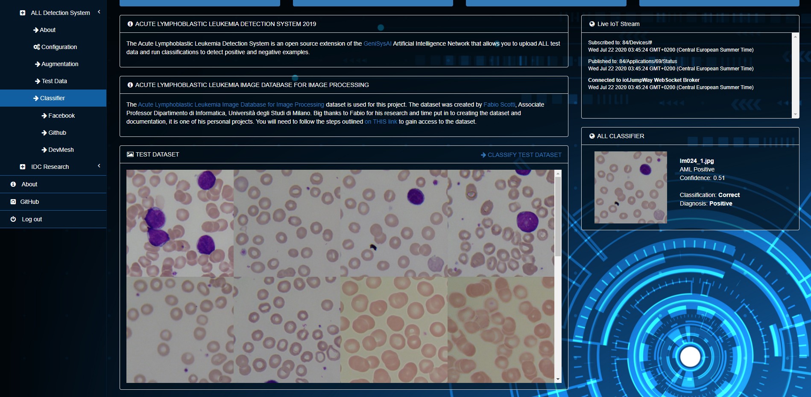
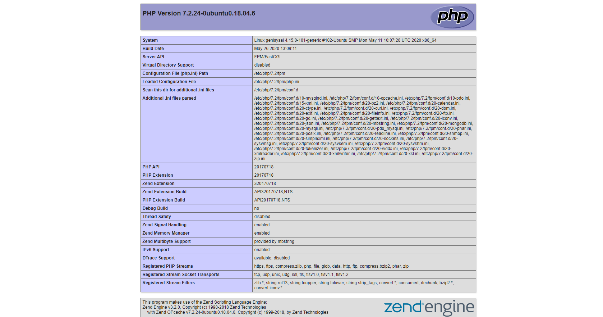
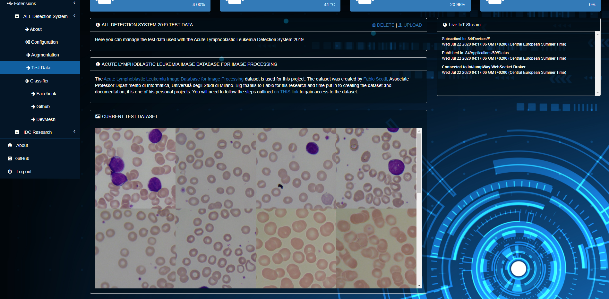
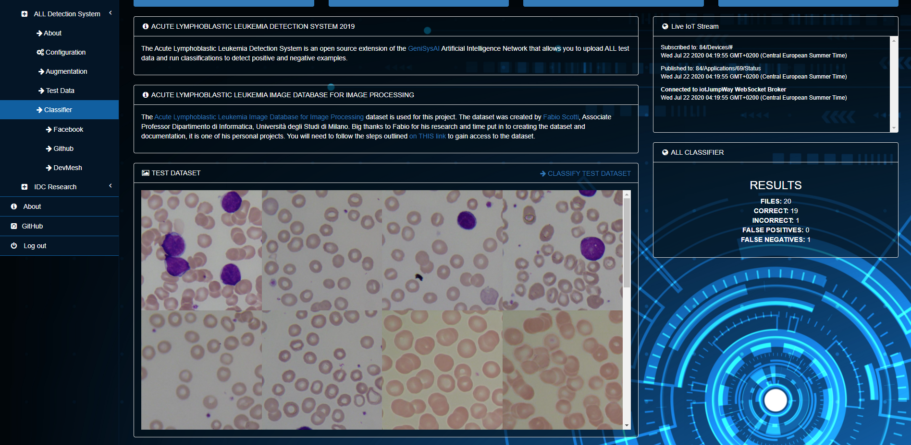

# Peter Moss Acute Myeloid & Lymphoblastic Leukemia AI Research Project
## Acute Lymphoblastic Leukemia Detection System 2019
### GeniSysAI Server


&nbsp;

# Table Of Contents

- [Introduction](#introduction)
- [About GeniSysAI Server](#about-genisysai-server)
- [What Will We Do?](#what-will-we-do)
- [Installation & Setup](#installation--setup)
    - [Install Ubuntu 18.04](#install-ubuntu-1804)
    - [Setup Domain Name](#setup-domain-name)
    - [Install Nginx](#install-nginx)
    - [Setup Port Forwarding](#setup-port-forwarding)
    - [Install Let's Encrypt](#install-lets-encrypt)
    - [UFW Firewall](#ufw-firewall)
    - [Install MySql](#install-mysql)
    - [Install PHP](#install-php)
    - [Install phpMyAdmin](#install-phpmyadmin)
    - [Import MySql Databases](#import-mysql-databases)
    - [Install iotJumpWay](#install-iotjumpway)
    - [Install Repository Code](#install-repository-code)
    - [Update Configuration](#update-configuration)
    - [Manual Settings](#manual-settings)
    - [Server Settings](#server-settings)
- [Extensions](#extensions)
    - [All Detection System 2019 UI](#all-detection-system-2019-ui)
    - [Local NLU Engine](#local-nlu-engine)
    - [Local TASS Engine](#local-tass-engine)
    - [Future Extensions](#future-extensions)
- [Voice Recognition](#voice-recognition)
- [Contributing](#contributing)
    - [Contributors](#contributors)
- [Versioning](#versioning)
- [License](#license)
- [Bugs/Issues](#bugs-issues)

&nbsp;

# Introduction

GeniSysAI is an open source Artificial Intelligence Assistant Network using Computer Vision, Natural Linguistics and the Internet of Things. GeniSysAI uses a system based on [TASS A.I](https://github.com/TASS-AI/TASS-Facenet "TASS A.I") for [vision](https://github.com/GeniSysAI/Vision "vision"), an [NLU engine](https://github.com/GeniSysAI/NLU "NLU engine") for natural language understanding, in browser speech synthesis and speech recognition for speech and hearing, all homed on a dedicated Linux server in your home and managed via a secure UI.


This version of the GeniSysAI server includes an extension for the Acute Lymphoblastic Leukemia Detection System 2019. The extension allows you to upload your test data and send it to the Acute Lymphoblastic Leukemia Detection System 2019 classifier and see the response in a graphical interface.

&nbsp;

# About GeniSysAI Server
[](https://github.com/GeniSysAI/Server)
[GeniSysAI Server](https://github.com/GeniSysAI/Server "GeniSysAI Server") is a customisable management system for [GeniSysAI](https://github.com/GeniSysAI/Server "GeniSysAI") networks. The GeniSys management system is built on top of [Ubuntu 18.04.1 LTS (Bionic Beaver)](http://releases.ubuntu.com/18.04/ "Ubuntu 18.04.1 LTS (Bionic Beaver)"), but there should be no issues using other Linux operating systems. The server uses a secure PHP/MySql Nginx server, [Let’s Encrypt](https://letsencrypt.org/ "Let’s Encrypt") for free SSL encryption, and free IoT connectivity via the [iotJumpWay](https://www.iotJumpWay.tech "iotJumpWay").

Although the completed GeniSys Server will be accessible via the outside world, this is only to help ensure encrypted traffic over your local network. The Nginx server will proxy traffic to your internal IPs for features such as the local NLU, the local TASS system is designed to access the local camera of the device the program is running on.

&nbsp;

# What Will We Do?
This tutorial will help you setup the server required for your GeniSys network, and also takes you through setting up iotJumpWay devices and applications. In detail this guide will cover the following:

- Installation: Ubuntu 18.04, Nginx, Let's Encrypt, PHP, MySql, phpMyAdmin, UFW, iotJumpWay
- Setup: Nginx, PHP, MySql, phpMyAdmin, IPTables, iotJumpWay, Domain name & DNS configuration, router port forwarding, UFW security, Device Proxies

&nbsp;

# Installation & Setup
The following guides will give you the basics of setting up a GeniSys Server. 

## Install Ubuntu 18.04
For this project, the operating system of choice is  [Ubuntu 18.04.1 LTS (Bionic Beaver)](http://releases.ubuntu.com/18.04/ "Ubuntu 18.04.1 LTS (Bionic Beaver)"). To get your operating system installed you can follow the [Create a bootable USB stick on Ubuntu](https://tutorials.ubuntu.com/tutorial/tutorial-create-a-usb-stick-on-ubuntu#0 "Create a bootable USB stick on Ubuntu") tutorial.

## Setup Domain Name
Now is as good a time as any to sort out and configure a domain name. You need to have your domain already hosted on a hosting account, from there edit the DNS zone by adding an A record to your public IP, for this you need a static IP or IP software that will update the IP in the DNZ Zone each time it changes.

Once you have done this your domain name or subdomain will be pointing towards your public IP, if port 80 and 443 are not currently listening for traffic then visiting your domain name will result in a timeout for now.

## Install Nginx
Now it is time to install Nginx, follow the commands below to install the required software.

```
  sudo apt-get install nginx
  sudo cp /etc/nginx/sites-available/default /etc/nginx/sites-available/default.backup
  sudo systemctl status nginx.service
  sudo nano /etc/nginx/sites-available/default 
  sudo nginx -t
  sudo systemctl reload nginx
```

What the above commands do is:

- Installs Nginx
- Makes a copy of the default Nginx configuration named default.backup
- Checks the status of the service (server)
- Here you need to edit the default Nginx configuration replacing example.com in server_name (example.com www.example.com)
- Checks if the configuration is OK
- Reloads the Nginx service

You can check the Nginx logs by using the following command:

```
cat /var/log/nginx/error.log
```

## Setup Port Forwarding
Now you have your domain pointing to your public IP, it is time to add a port forward, traffic to your network will be coming from port 80 (insecure) and secure. Although Nginx will bounce the insecure traffic to port 443, we still need to add a port forward for port 80 as well as 443. How you will do this will vary, but you need to find the area of your router that allows you to add port forwards, and then add one port forward for incoming insecure traffic to port 80 of the server, and one for port 443. This will open the HTTP ports on your router and forward the traffic to the same ports on your server. In the case someone tries to access using insecure protocol (http - port 80) they will be automatically be sent to the secure port of the server (https - 443)

## Install Let's Encrypt
Security is everything, and it is even better when security is free ;) To encrypt our network we are going to use SSL provided by [Let’s Encrypt](https://letsencrypt.org/ "Let’s Encrypt"). Follow the commands below to set up Let’s Encrypt.

```
  sudo add-apt-repository ppa:certbot/certbot
  sudo apt-get update
  sudo apt-get install python-certbot-nginx
  sudo certbot --nginx
```

If you have followed above correctly you should now be able to access your website, but only using the secure protocol, 443, ie: https. If you visit your site you should now see the default Nginx page.

## UFW Firewall
Now you will set up your firewall:

```
  sudo ufw enable
  sudo ufw disable
```
Now add the ports that we will require to be open: (In future updates these rules will be tightened)

```
  sudo ufw allow 22
  sudo ufw allow 80
  sudo ufw allow 443
```

Finally start and check the status

```
  sudo ufw enable
  sudo ufw status
```

## Install MySql
Now it is time to install MySql on your server. Follow the commands below and complete any required steps for the installation to accomplish this.

```
  sudo apt-get install mysql-server
  sudo mysql_secure_installation
```

Now create a user and password that we will use for phpMyAdmin, first login in with the root MySql username you created earlier and then enter the password when prompted, this will log you into MySql as that user.

```
 mysql -u YourMySqlRootUser -p
```

Now we can create a user with the required permissions to manage phpMyAdmin, make sure you remember the credentials you create with the below command.

```
 mysql> GRANT ALL ON *.* TO 'YourNewUsername'@'localhost' IDENTIFIED BY 'YourNewPassword';
```

Also create a user for your application database.

```
 mysql> GRANT SELECT, INSERT, DELETE  ON *.* TO 'YourNewUsername'@'localhost' IDENTIFIED BY 'YourNewPassword';
```

Finally, create the required database:

```
 mysql> CREATE DATABASE YourDatabaseName
```

## Install PHP
Now you will install PHP on your server. Follow the commands below and complete any required steps for the installation to accomplish this. You may need to swap 7.2 in the second command depending on what version of php-fpm is installed.

```
  sudo apt-get install php-fpm php-mysql
  sudo nano /etc/php/7.2/fpm/php.ini
```

You should now be in the nano editing window, find  **cgi.fix_pathinfo** and change the value to 0

```
cgi.fix_pathinfo=0
```

Then restart PHP:

```
  sudo systemctl restart php7.2-fpm
```

Now you need to open the default configuration:

```
  sudo nano /etc/nginx/sites-available/default
```

and match the [example default configuration](etc/nginx/sites-available/default "example default configuration"), replacing **YourSubdomain.YourDomain.TLD** where relevant and updating the endpoint names. Once you have completed those steps, issue the following commands which will tell you if the configuration is ok and if so you can reload Nginx. 

```
  sudo nginx -t
  sudo systemctl reload nginx
```

If you now visit the info page your website ie: https://www.YourDomain.com/info you should see the PHP configuration of your server.



## Install phpMyAdmin
Now you should install phpMyAdmin and upload the default MySql table configuration.
 
```
  sudo apt-get install phpmyadmin
```
Press tab -> enter -> yes -> password, then create a link to phpMyAdmin, if you want to home this in a place other than phpmyadmin you can simply rename phpmyadmin in the command below.

```
  sudo ln -s /usr/share/phpmyadmin /var/www/html
```

Now you should be able to visit phpMyAdmin by accessing the relevant directory on your website. 

## Import MySql Databases
First you can download the [basic database structure](sql.sql "basic database structure") required for the GeniSys server. This file also includes the tables you will need for the Acute Lymphoblastic Detection System 2019 UI. 

Once you are logged in to phpMyAdmin, visit the import tab and import the sql file you just download and import it into the database you created earlier in the tutorial. 

## Install iotJumpWay
Now you need to install the iotJumpWay and setup some appications and devices. The following part of the tutorial will guide you through this. 

- [Find out about the iotJumpWay](https://www.iotjumpway.com/how-it-works "Find out about the iotJumpWay") 
- [Find out about the iotJumpWay Dev Program](https://www.iotjumpway.com/developers/ "Find out about the iotJumpWay Dev Program") 
- [Get started with the iotJumpWay Dev Program](https://www.iotjumpway.com/developers/getting-started "Get started with the iotJumpWay Dev Program") 

[](https://www.iotJumpWay.tech/console)

First of all you should [register your free iotJumpWay account](https://www.iotjumpway.com/console/register "register your free iotJumpWay account"), all services provided by the iotJumpWay are also entirely free within fair limits. Once you have registered you need to:

- Create your iotJumpWay location [(Documentation)](https://www.iotjumpway.com/developers/getting-started-locations "(Documentation)") 
- Create your iotJumpWay zones [(Documentation)](https://www.iotjumpway.com/developers/getting-started-zones "(Documentation)") 
- Create your iotJumpWay application [(Documentation)](https://www.iotjumpway.com/developers/getting-started-applications "(Documentation)") 

To install the iotJumpWay MQTT software issue the following command on your server:

```
  sudo pip install JumpWayMQTT
```

## Install Repository Code
Now you can add the repository code to your server, to do this follow the guide:

- Clone the repo to the desktop of your server, or your preferred location on your server. The repository files have the same paths they would have on your server. 
- [/etc/nginx/sites-available/default](etc/nginx/sites-available/default  "/etc/nginx/sites-available/default") is an example of how your server NGINX configuration should look, located on your server in the same location as in the repo.
- You can copy the entire contents of the [var/www](var/www  "var/www") directory to the /var/www directory on your server.

## Update Configuration
Now it is time to update our server configuration. Open the [/var/www/classes/AIcore/confs.json](var/www/classes/AIcore/confs.json  "/var/www/classes/AIcore/confs.json") file on your server and add your database credentials and a secure 32bit key for your encryption, your iotJumpWay application credentials, iotJumpWay location ID and Application MQTT credentials. You will use your iotJumpWay application credentials to authenticate yourself onto the UI.  

```
{
    "dbname" : "",
    "dbusername" : "",
    "dbpassword" : "",
    "key"  : ""
}
```

## Manual Settings
Before you can use your server UI you need to add some comfiguration to the database. Navigate to your PhpMyAdmin and login as your root user. You should already have the [example default configuration](etc/nginx/sites-available/default "example default configuration") installed, if not you can do this now, then head to the **settings** table. You need to encrypt some values and enter them into the database manually before you will be able to access the UI. You will find the encryption function in [var/www/classes/helpers.php](var/www/classes/helpers.php "var/www/classes/helpers.php").

The [var/www/encrypt.php](var/www/encrypt.php "var/www/encrypt.php") script has been provided to allow you to easily encrypt the data you need to add to your settings table. 

In the encrypt script, update the following:

```
$domainString = "";
$jumpwayAppID = 0;
$JumpWayAppPublic = "";
$JumpWayAppSecret = "";
```

The fields above are as follows:

- domainString: The full URL for your domain, ie: https://www.google.com
- jumpwayAppID: Your IoT JumpWay App ID
- JumpWayAppPublic: Your iotJumpWay App Public Key
- JumpWayAppSecret: Your iotJumpWay App Secret Key

Once you have completed these steps simply visit **https://www.YourServerDomain.com/encrypt**. The encrypted values will be displayed and you can add these to the relevant fields in your database. 

## Server Settings
[](https://github.com/GeniSysAI/Server)
First we need to visit the the Server Cinfiguration page, from the UI menu you can click on Server and then Server Configuration. Here you need to add the Server Name which is your choice of name to identify your server in the system, this will also be used as the meta title for your UI pages, then you need to update your Server URL, which is your fully qualified domain name (FQDN), and then complete the rest of the settings, if you do not see an error message, all is well.

&nbsp;

# Extensions
The GeniSys Server is only the hub of the GeniSys network. Through the UI you can manage various aspects of your AI network including the local NLU Engine and TASS system, as well as other AI / IoT smart home devices. 

## All Detection System 2019 UI

As mentioned the All Detection System 2019 UI allows you to upload data to the server, and then use it to send to the classifier for classification.

First you need to create an [iotJumpWay device](https://www.iotjumpway.com/developers/getting-started-devices "iotJumpWay device") for your classifier. Once you have done this, you will be able to select the device on the **Extensions->ALL Detection System->Configuration** page. Once you update the settings, you will be presented with more configuration for your device. Fill these details and you will then be able to use the classifier.



Head to the **Extensions->ALL Detection System->Test Data** page and upload the test data that you set aside when training your classifier. 

Then make sure your classifier is running in server mode, head to the **Extensions->ALL Detection System->Classifier** page and hit the **Classify Test Data** button just above the data. The system will send each image to the classifier, and you will see the response visually in the UI.



You can also hit each data slide individually and see the individual classifications for each image. Hovering over an image will show you the file name of the data slide.

## Local NLU Engine
After following the [GeniSys NLU Engine](https://github.com/GeniSysAI/NLU "GeniSys NLU Engine") tutorial you will be able to manage,sss train and infer using the UI. 

## Local TASS Engine
After following the [GeniSys TASS Engine](https://github.com/GeniSysAI/Vision "GeniSys TASS Engine") tutorial you will be able to manage, train and infer using the UI.

## Future Extensions
Further extensions are under development including a management system for the IDC Classifier ([Breast Cancer AI](https://www.facebook.com/BreastCancerAI "Breast Cancer AI")).

&nbsp;

# Voice Recognition
It is now possible to interact with GeniSys using your voice. This feature is powered by an open source project [annyang](https://github.com/TalAter/annyang "annyang") which is basically a wrapper for the voice recognition feature of the web speech API, according to  [caniuse](https://caniuse.com/#feat=speech-synthesis "caniuse") support seems to be finally much wider including: Edge, Firefox, Chrome, Safari, ios Safari, Chrome for Android and Samsung Internet, but I have not tested anything other than Chrome. In Chrome for Android an alert noise is made every time the voice recognition restarts, this is unavoidable and there has been a long time developer request for Google to remove this feature but Google are adimant that it will remain. 

If you have updated your server code and booted up the server you should get asked for permissions to use the microphone, once you accept you will be able to speak to your NLU providing the NLU is online.

&nbsp;

# Contributing

The Peter Moss Acute Myeloid & Lymphoblastic Leukemia AI Research project encourages and welcomes code contributions, bug fixes and enhancements from the Github.

Please read the [CONTRIBUTING](../CONTRIBUTING.md "CONTRIBUTING") document for a full guide to forking our repositories and submitting your pull requests. You will also find information about our code of conduct on this page.

## Contributors

- [Adam Milton-Barker](https://www.leukemiaresearchassociation.ai/team/adam-milton-barker "Adam Milton-Barker") - [Asociacion De Investigation En Inteligencia Artificial Para La Leucemia Peter Moss](https://www.leukemiaresearchassociation.ai "Asociacion De Investigation En Inteligencia Artificial Para La Leucemia Peter Moss") President & Lead Developer, Sabadell, Spain

&nbsp;

# Versioning

We use SemVer for versioning. For the versions available, see [Releases](../releases "Releases").

&nbsp;

# License

This project is licensed under the **MIT License** - see the [LICENSE](../LICENSE "LICENSE") file for details.

&nbsp;

# Bugs/Issues

We use the [repo issues](../issues "repo issues") to track bugs and general requests related to using this project.